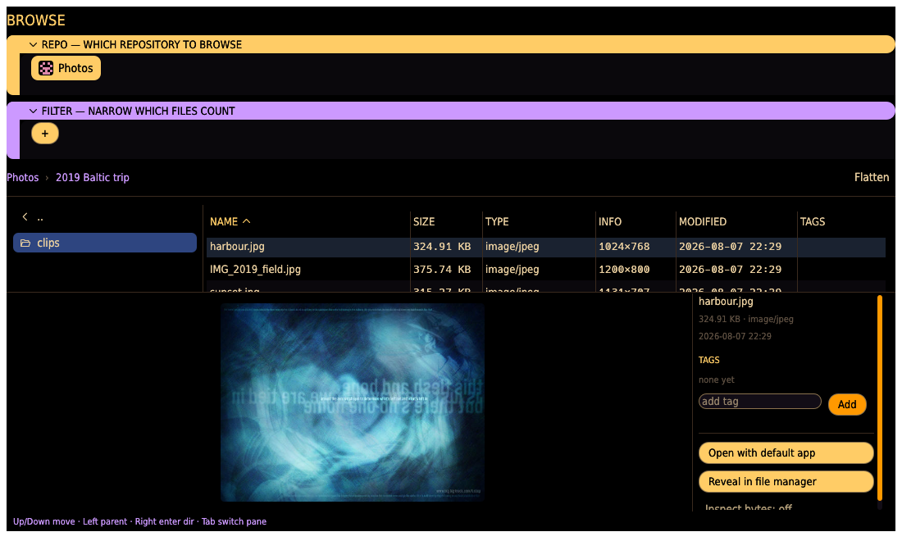

# Browse tab

Walk one repository's indexed files as a **folder tree**, look at any file in the shared
viewer, and annotate files with **tags** — a keyboard-driven file browser over the index, not
the disk, so it shows exactly what has been scanned.

## Repo and filter

- **REPO** — the single repository to browse (its chip carries the **★ MAIN** badge when it is
  a sync group's main).
- **FILTER** — the same condition builder as the other tabs, narrowing which files appear.

## Navigating

- A **breadcrumb** across the top shows where you are (`Photos › 2019 Baltic trip`); click any
  crumb to jump back up.
- The left pane lists **subdirectories** of the current folder; the right pane lists the
  **files** in it, as a sortable table — **NAME**, **SIZE**, **TYPE**, **INFO** (pixel
  dimensions for images, duration for audio), **MODIFIED**, and **TAGS**.
- **Keyboard**: `↑`/`↓` move within a pane, `→` enters the highlighted directory, `←` goes to
  the parent, and `Tab` switches between the directories pane and the files pane. Selection
  supports ranges for batch actions.
- **Flatten** (top-right toggle) hides the directories pane and lists **every** matching file
  under the current folder, recursively — the way to act on a whole subtree at once, or to see
  everything of one kind the filter selects regardless of where it sits.

## The preview / detail dock

Selecting a file fills the dock at the bottom-right: a **preview** (a real thumbnail for
images and video, a spectrogram for audio), the file's facts (size, type, date), and its
**TAGS**. From here you can:

- **add a tag** — type a label and **Add**; tags are free-form and stored in the index, so
  they survive rescans and drive the filter and the Duplicates/Grooming triage.
- **Open with default app** — hand the file to the system's default application (the
  full-fidelity escape hatch, and the way to actually watch a video full-speed).
- **Reveal in file manager** — show the file in its folder on disk.
- **Inspect bytes** — toggle a raw-bytes readout for the selected file.

## The viewer

Clicking a file opens the **same full-window viewer** every other surface uses — see
[The viewer](duplicates.md#the-viewer-lightbox) for the full set of representation tabs
(Image, Video, Audio, Metadata, Text, Render, Strings, Hex) and their controls. From Browse it
opens on the file alone; **SHOW B** brings up a second file to compare against.
