# Duplicates tab

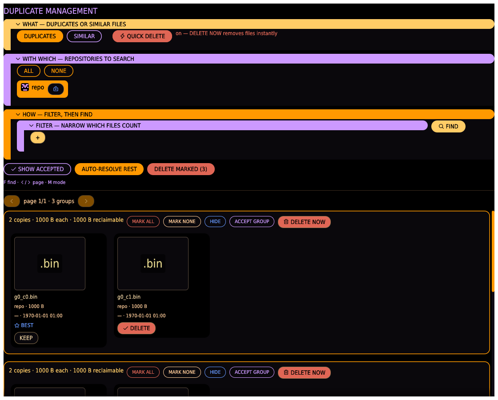

Find exact or perceptually similar duplicates across one or more repositories, review them
with real previews, and delete the worse copies — batched per repo, always confirmed unless
you turn on Quick Delete. This is the GUI equivalent of `repo dupes`, with a full review
workflow on top.

## Repo bar

One chip per registered repository:

- Click the **name** to toggle whether that repo is included in the next FIND. Excluded
  repos are skipped entirely.
- Click the **padlock** to toggle read-only: a closed lock means files in that repo are
  protected from deletion (never preselected, never marked, even by auto-resolve); an open
  lock means they can be deleted like any other file.
- **REFRESH** reloads the repository list (e.g. after adding one in the Repositories tab).

## Mode, threshold, and FIND

- **DUPLICATES** — exact, byte-for-byte matches (same size and BLAKE3 hash). Fast, no false
  positives.
- **SIMILAR** — perceptually similar images and videos: re-saves, re-encodes, or crops that
  don't hash identically but look alike. Reveals a **similarity threshold** slider (50–100%,
  `similarity % = (1 − hamming distance / bits) × 100`); lower catches more — and riskier —
  matches, 100% is bit-identical, and ≥99.5% is labeled "identical" since it's visually
  indistinguishable in practice. The threshold persists across launches.
- **FIND** searches every included repo per the selected mode.

**QUICK DELETE** gives every group its own DELETE NOW button that deletes marked files
immediately, no confirmation — turn it off to go back to confirming every batch.

Below the results: **AUTO-RESOLVE REST** marks every non-best copy for deletion (skipping
read-only repos) so you only have to review the marks, and **DELETE MARKED (n)** deletes
everything currently marked, batched per repo in one transaction, behind a confirmation.

## Result groups

Results page 50 groups at a time (← / → to navigate). Each group shows a header (copy count,
size, reclaimable bytes) and one card per file:

- Thumbnail (click to open the [viewer](#the-viewer-lightbox)), path, repo, size, dimensions,
  mtime.
- **from `<repo>`** — if this file's provenance is known (it was copied/synced in from
  another repo).
- Audio files get inline **PLAY/PAUSE** + a seek bar (see [Audio preview](#audio-preview)).
- Text files preview their **first lines** right on the card — two copies of a note or a
  config read apart at a glance, without opening either.
- PDFs show their **actual first page** (rendered in the background; needs poppler, falls
  back gracefully). Any other file — a database, an executable, an unknown blob — shows a
  **byte view**: its head bytes as a greyscale pattern with the extension in big colour-coded
  letters. Identical content produces an identical pattern, so two duplicates *look* the same.
- A file that is gone from disk wears an amber **MISSING** veil over its (cached) preview —
  what vanished stays recognisable.
- The best copy is starred **BEST**.
- **KEEP / DELETE** toggles this copy's mark. Nothing is deleted until you press DELETE
  MARKED (or DELETE NOW under Quick Delete).
- A file in a read-only repo shows a **read-only** badge instead of KEEP/DELETE —
  right-click or long-press it to unlock just that one file (a deliberately inconvenient
  escape hatch, never bulk-set, reset on the next FIND).
- Right-click anywhere on a card for **OPEN** (hand the file to the system's default app) and
  **SHOW IN FOLDER** (reveal it in the file manager) — the full-fidelity escape hatch for
  any file type, and the designated way to actually play a video full-screen.

## The viewer (lightbox)

Click any card — the thumbnail, or the typed placeholder a document or archive shows instead
of a picture — to open the full-window viewer. It is the **same viewer every surface opens**:
Browse, the review boards and Transfer's DIFF all land on this one screen, so it behaves
identically wherever you came from. It opens on the clicked file alone, on the file's own
representation: a photo on Image, a track on Audio, a document on Text.

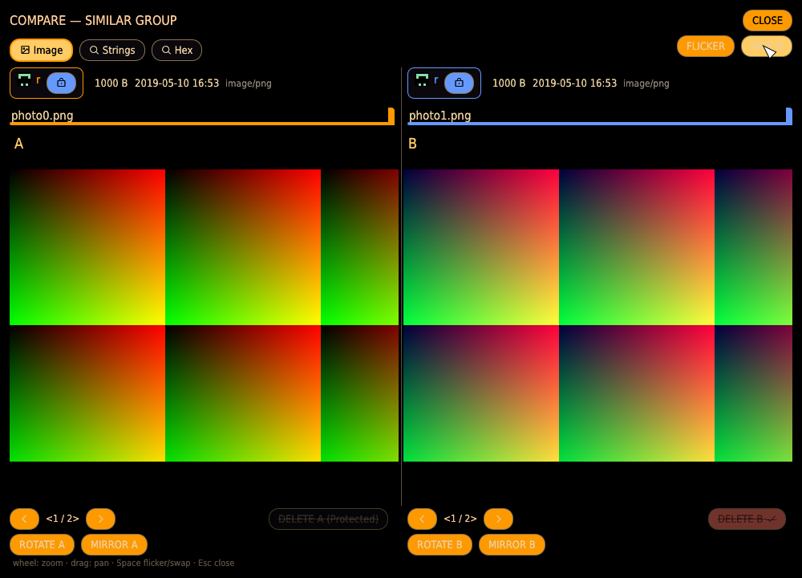

**Layout.** The top of each side is a read-only **identity block** — a bordered repo chip, the
**file name** (bold, led by a small LCARS accent cap in the side's colour), and its size / date /
type (the bigger size and older date highlighted) — *what the file is*. Every control lives in
the **fixed action bar along the bottom** — *what you can do*. The two sides are separated by a
**centre divider**, and every part of the layout is **content-independent**: each side keeps a
fixed half, so a long name or a wide document line is scrolled or clipped within its own half
rather than shoving the other side off-screen. The file name itself sits in a fixed-width field
that sticks to the end (the filename and extension) and is **selectable** — drag to the front and
copy the whole path — so even a very long path never grows the layout.

**What kind of match.** The title says whether you are looking at exact **duplicates** or a
**SIMILAR** search, and for a similar search it names the threshold — `SIMILAR GROUP (≥ 90%)`.
When two files are shown, the action bar also reads the **pair's own similarity**
(`A ↔ B 99%`), so a loosely-grouped match never poses as a byte-for-byte duplicate. The shot
above is a similar match — a photo and its horizontal **mirror**, which the flip-invariant
perceptual hash scores as near-identical; **MIRROR A** flips one side to line the two up.

**Two sides.** SHOW B reveals a second side — another member of the group, never the file
already shown — and HIDE B returns the first file to the whole screen. Each side's action bar
carries its own mark pill: **DELETE** for a single file, **DELETE A** / **DELETE B** while both
are shown, each toggling only its own copy's mark without closing the viewer. A copy in a
read-only repository shows a disabled, struck-through `… (Protected)` pill instead.

**Switching copies.** With one file shown, a compact switcher (`‹ 1 / 2 ›`, the arrows the
click targets) steps through the whole group. With both sides shown, each side's switcher skips
the file the other side is showing — the two sides can never be the same file — and the
position counts that side's candidates, never the group size; a two-copy group then offers no
switcher at all, because the only other candidate is already on the other side.

### The single-file view

Clicking a card opens the file **alone** — no second side, no divider — the same identity block,
tab bar and action bar, with one image (or spectrogram, filmstrip, text, hex dump) filling the
pane. **SHOW B** brings up a comparison. Every tab renders the same whether one file or two are
shown; a single file simply has nothing to diff against, so it shows its own content.

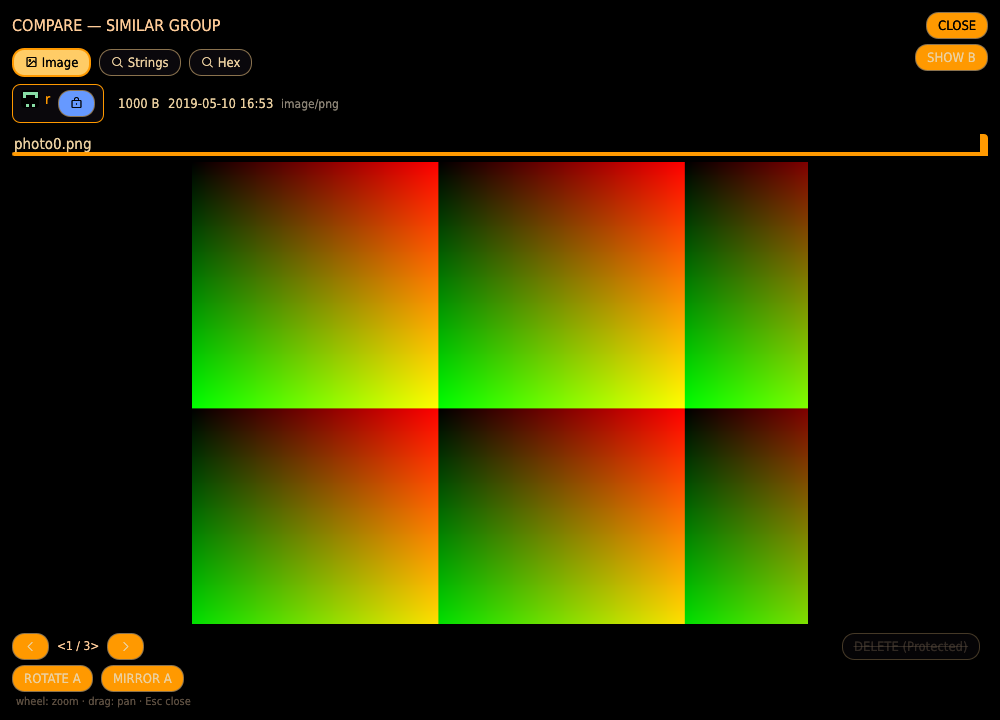

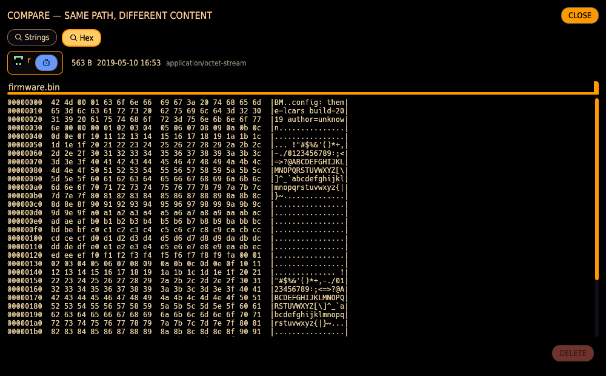

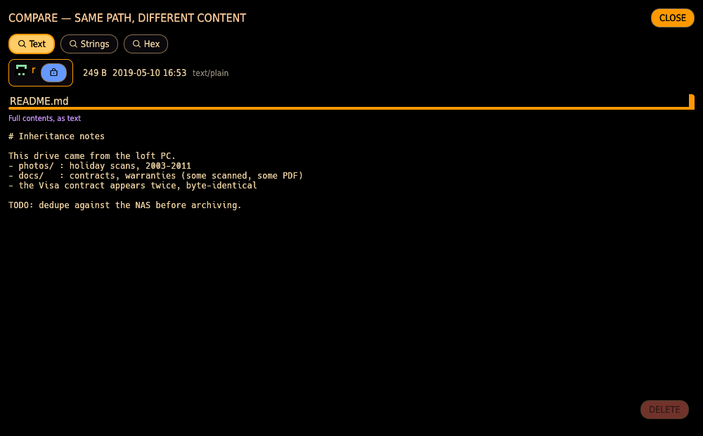

### Representation tabs

A file can be looked at in more than one way, so the viewer is tabbed by *representation*.
The tab bar offers every representation at least one side has — **Image**, **Video**,
**Audio**, **Metadata**, **Text**, **Render**, **Strings**, **Hex** — a photo has no Audio tab, an
untagged FLAC no Metadata tab, **Text** only a file with readable words, and **Render** only a
document that can be drawn as pages (a PDF, or an office/legacy file when LibreOffice is
installed); but **Strings** and **Hex** are offered for every file. Selecting a tab draws only the
column(s) whose file supports it, always
left (A) against right (B), never stacked. If a side steps to a copy that lacks the current
representation, the viewer drops back to the pair's own representation.

**Image**: mouse-wheel zooms around the cursor, drag pans, and FLICKER (or `space`) shows one
file at a time in the pane — the fastest way to spot a subtle edit. Flicker is **single-file
focus**: only the shown file's facts and its ROTATE / MIRROR / SAVE / delete are on screen, and
**SWAP** flips the picture and all of that to the other file together, so there is no hidden
side to act on by accident; SIDE BY SIDE returns. ROTATE / MIRROR turn
one side to align a copy somebody flipped; the turn carries into the comparison. **SAVE** then
writes the turned image to disk: **OVERWRITE** replaces it in place, **SAVE COPY** writes a
`_rot` sibling and leaves the original alone. A **locked** ("Protected") repository allows the
copy — it only adds a file — but not the overwrite or a delete, which are shown disabled with
the reason. Either way the file keeps its modified time — a turned scan is still the same
photograph from the same date — or, when the image carries an EXIF capture date, the dialog can
stamp the file's date from EXIF instead. An overwrite re-indexes the file immediately, so its
new content identity is never stale.

**Audio** is the listening transport: each side's **waveform** with a moving playhead and an
**elapsed / total** readout — **click anywhere in the wave to play from that spot** — plus
**PLAY A** / **PLAY B**, **PAUSE**, and a cycling **SPEED** pill that steps through
**0.25 / 0.5 / 0.75 / 1 / 1.5 / 2×**. The **Spectrum** tab beside it holds the zoomable
**spectrogram** comparison (frequency-vs-time, the visual fingerprint), with the same
zoom/pan/FLICKER the Image tab has. The speed is **pitch-preserving**: a
slowed passage still sounds like the recording rather than dropping an octave, so it stays
recognizable while small differences between two takes become audible (the slowed track is
pre-rendered once with ffmpeg's `atempo` and cached, so the first use of a speed costs a beat
and every use after is instant). Playing while both sides are shown loads the two copies as a
synced pair — at the chosen speed on both — so `←`/`→` flip which copy is audible instantly
and gap-free, and any difference is heard rather than masked by a pause. With one file shown,
`←`/`→` step through the group keeping the transport state: playing keeps playing the newly
shown copy, and a deliberate pause stays paused with the new copy loaded, so play resumes the
file you are actually looking at. `P` toggles play/pause.

**Metadata** shows the file's tags. For MP3/WAV/AIFF that is the ID3 editor: EDIT TAGS opens
Title/Artist/Album/Year/Track/Genre for that copy; a **`⋮` (more-options) button** beside a
field appears when another copy in the group has a different value, and opens a menu of those
values to pull one *into* this field (adopt the best one — it never writes to the other side).
SAVE TAGS writes only the tags — the audio itself is untouched. `T` jumps straight here with the editor open. A file in a read-only
repository is shown but never editable. For images the tab lists **every EXIF field** the
file carries — camera, capture date, exposure, GPS, all of it — as recorded; EXIF is not
edited here. When two files are compared, the fields that **differ** between them are
highlighted, and **SAVE METADATA** writes a side's fields to a plain-text sidecar in a folder
you pick — so the Title/Author/Keywords are rescued before you delete a copy.

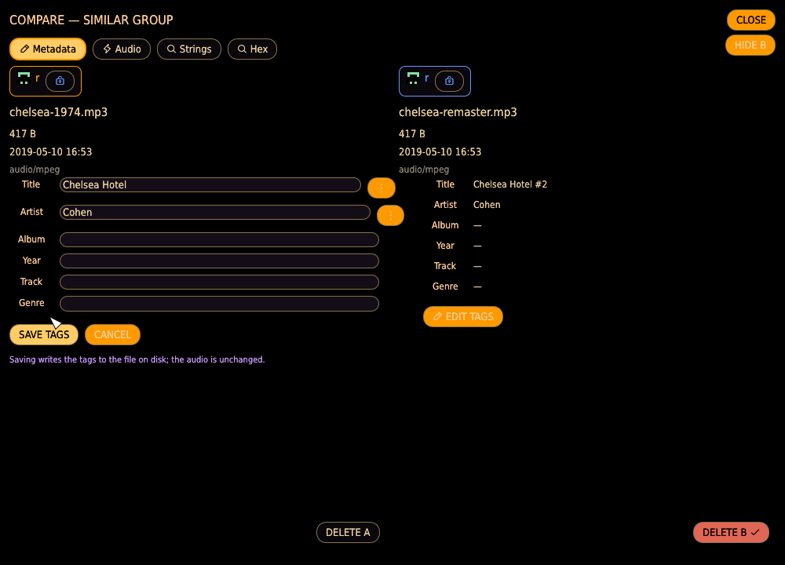

**Text** is offered for a file with **readable text** — a **document whose purpose is text** (a
PDF, a Word or OpenDocument file, a spreadsheet, a presentation, or an email; see
[Document formats read as text](index.md#document-formats-read-as-text)) or a **plain-text file**
(`.txt`, `.md`, `.csv`, source). For a document it shows the **extracted words**; for a plain-text
file, its text as written. One file shows its content; comparing two, their content is
**line-aligned side by side** so you can read what changed. Equal lines sit across from each
other; a line only one side has leaves the other blank (**green**); a line that changed shows
both versions with the differing characters marked (**amber**). Nothing is declared "the same" —
identical content simply shows no marks. A document that yields no text (scanned, encrypted, or
empty) says so plainly. Extraction runs in the background — a slow-to-parse PDF shows a short
note for a moment instead of freezing the app. Raw bytes are not here — they have their own
**Hex** tab.

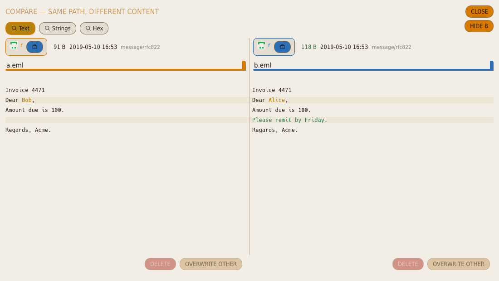

A document with no extractable text (scanned, encrypted, or empty) says so instead of
pretending to be blank:

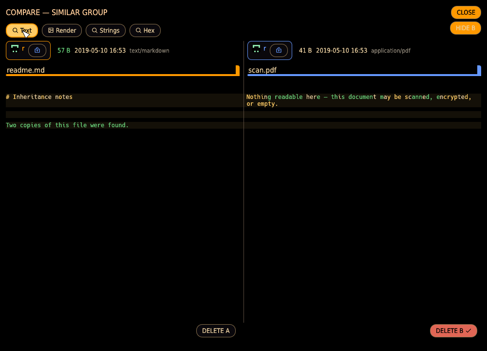

**Render** shows a **document** rasterized page by page — as it actually *looks*, not its
extracted words. A PDF renders directly; a Word, spreadsheet, presentation or OpenDocument
file — and the legacy formats the Text tab can't read, **`.doc` and `.rtf`** — is first
converted in the background (the first view takes a moment; after that the conversion is
reused for the whole session). Comparing two, **each side has its own page control**
(**prev/next**, an editable page number beside that side's own page count, and a slider for
sweeping a long document), so when one copy has an extra front page you line the two up
yourself — the tool states the counts and never guesses which page maps to which. Pages
render in the background, so even a huge book never freezes the app. The lined-up pages are
judged by eye: **FLICKER** (or `space`) swaps the current A page and current B page in place,
making a shifted paragraph or a changed figure jump out; there is no automated pixel diff and
no "same" verdict, because different rendering (fonts, antialiasing) makes pixel equality
meaningless. It's the visual counterpart to the Text tab's content diff — one reads the
words, the other shows the page. Requires `pdftoppm` (poppler) at runtime, and LibreOffice
(`soffice`) for the non-PDF formats; without a tool the affected tab simply doesn't appear,
the same way video needs `ffmpeg`.

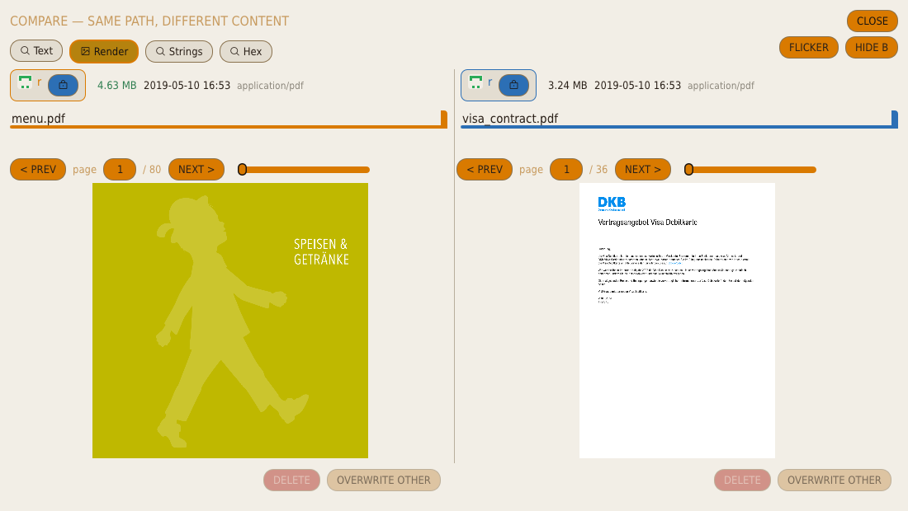

**Strings** is offered for **every** file and shows the printable runs (four or more readable
characters) embedded in its bytes — the text hiding inside a binary: an image's EXIF strings, an
audio file's tags, a program's paths and version banners. One file lists its runs; comparing
two aligns them so shared embedded text lines up and each side's distinct runs stand out (the
same green/amber marking as the content diff). It's the forensic "what text is in here" view for
files that aren't documents.

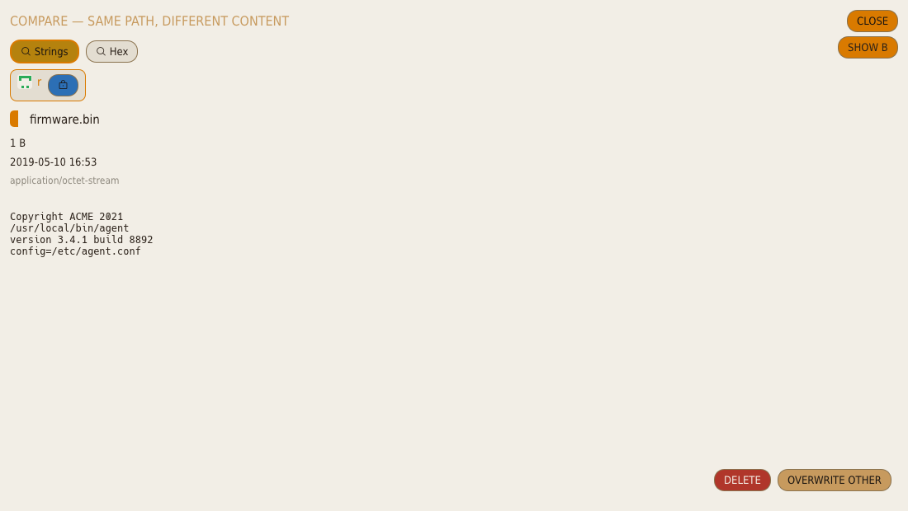

**Hex** is offered for **every** file, with no exceptions — the raw bytes are always one click
away. One file shows an offset/hex/ASCII dump of its head; comparing **two** it becomes a
**full-file, aligned hex diff**: the byte streams are aligned so equal runs line up — even when
one side has an inserted header — with the differences marked (a **green** gap where bytes exist
on only one side, **amber** where they differ on both). It **paginates** through the whole file,
**jump to next/previous difference** skips the long equal stretches, and a very large or
pervasively-different pair falls back to a coarse block-level match and says so. So two
same-sized "duplicates" that differ only in an inserted metadata header read as exactly that.

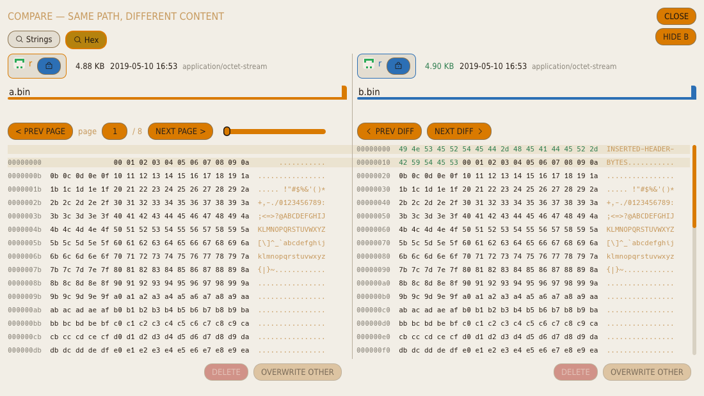

**Video** shows an **aligned filmstrip** per side — a row of frames sampled evenly across the
clip — so you see each clip's whole shape at a glance instead of guessing from one still (two
different clips so often share an identical first frame: black, a slate, a logo). **Clicking
the filmstrip** drops a **shared playhead** that decodes the exact frame of *both* clips at
that moment and shows it enlarged, **A @ t | B @ t**. The playhead is **proportional** — a
fraction of each clip's *own* duration — so a trimmed or re-encoded copy stays aligned at the
same relative moment instead of drifting. Frames come from the cached-JPEG grid, so the strip
is instant after first build.

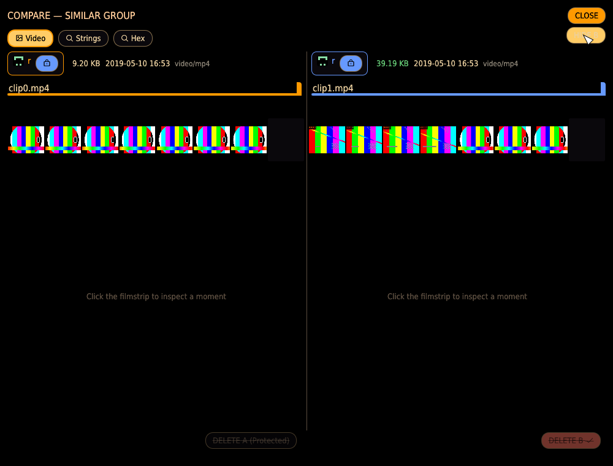

A clip that carries an audio track also offers the **Audio** tab beside Video: its soundtrack
is extracted once to a cached WAV and then compared exactly like a bare audio file —
waveform transport, spectrogram, playback and pitch-preserving speeds — so you can tell
whether two clips share the same footage, the same sound, or neither. (Extraction needs
`ffmpeg`; a silent clip, or a machine without ffmpeg, simply offers no Audio tab.) Full-speed
*watching* still lives on the OPEN (external app) path — the in-app tools augment the OS
player rather than replace it.

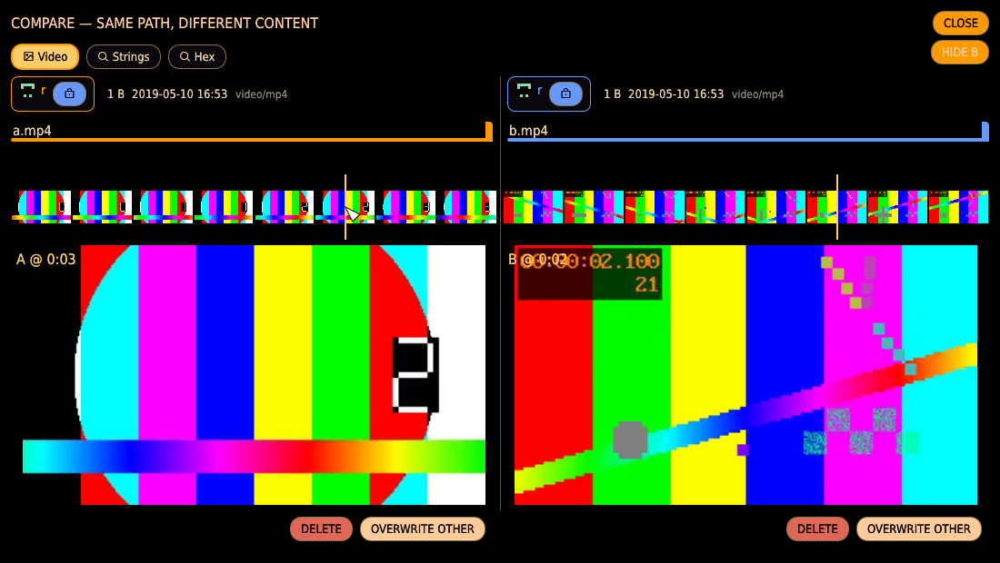

`Esc` steps back one level — out of flicker, or an open tag editor — and then closes the
viewer; whatever the viewer was playing falls silent with it.

## Audio preview

Audio duplicate cards get an inline **PLAY/PAUSE** button, an elapsed/total readout, and a
seek bar — confirm two "similar" tracks are actually the same recording (and which sounds
better) without leaving the app or opening an external player. Only one file plays at a time;
starting another replaces it. Playback survives scrolling and stops automatically when you
switch away from the Duplicates tab. Requires ALSA on Linux at build time (see the README);
with no audio device at runtime, the controls still render and playback is simply a no-op.

The [viewer](#the-viewer-lightbox) shares the same single audio device: opening a track there
and pressing PLAY replaces what a card was playing, and closing the viewer silences what it
started while leaving a card's own playback alone.

## Video preview

Video duplicate cards show a real still frame (sampled mid-timeline) instead of a generic
icon. Frames are extracted with `ffmpeg` on demand and cached; without ffmpeg on `PATH`, the
card falls back to the placeholder.
