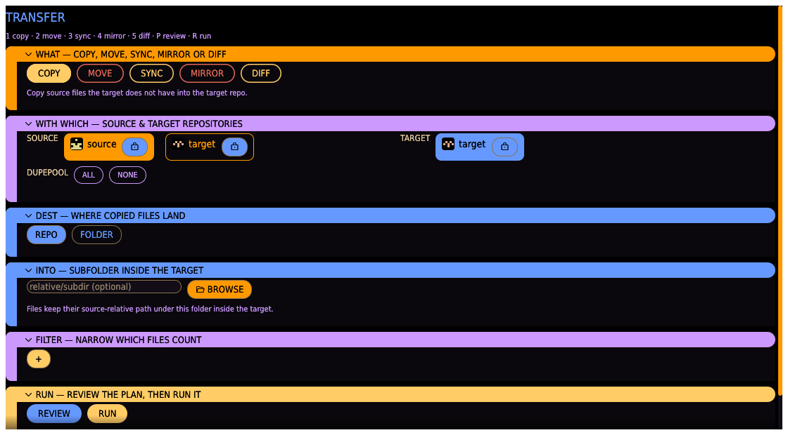
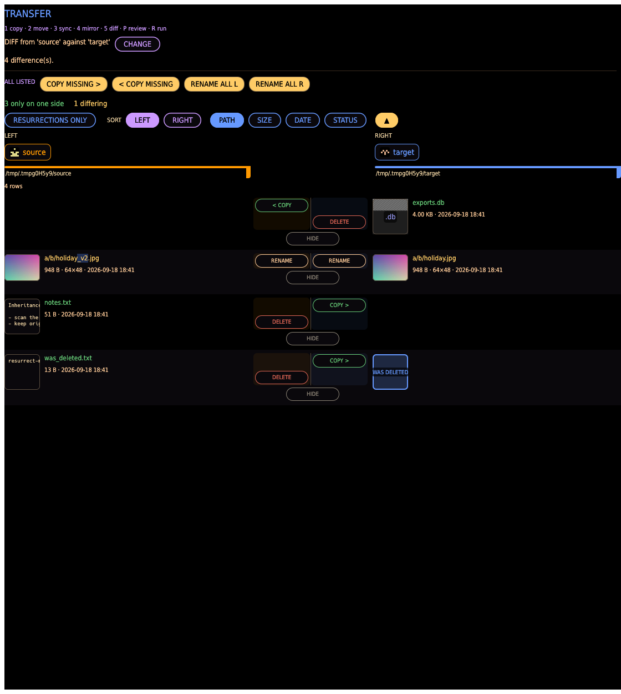
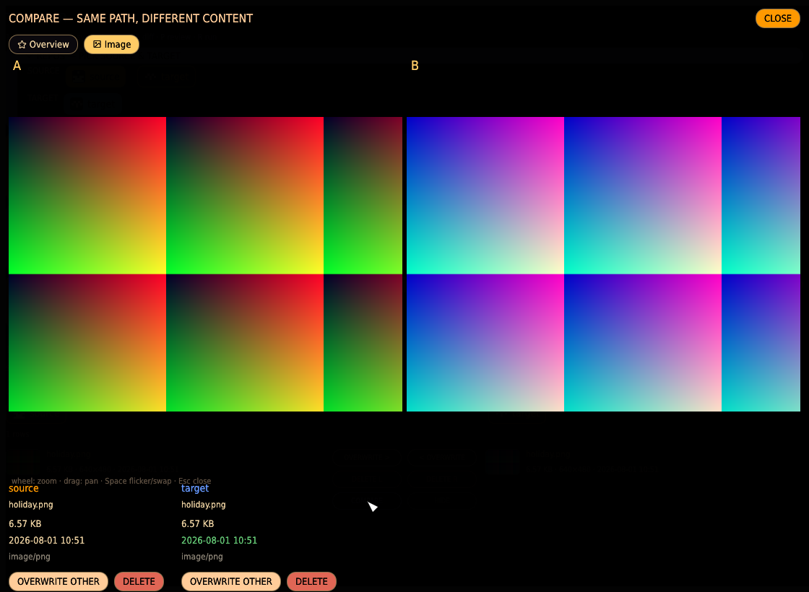
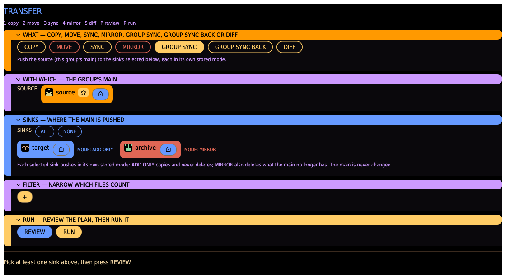

# Files tab

Copy, move, or delete files between repositories by content (size + BLAKE3 — paths never
matter), with an assisted filter builder and a review before anything runs. This is the GUI
equivalent of [`diff cp`/`mv`/`rm`](../cli.md#diff).

## Repo pickers

- **SOURCE** — the repository whose files are considered for transfer/deletion.
- **TARGET** — where COPY/MOVE places files (and always a reference for "already known"); for
  DELETE, the reference whose known content makes source files deletable.
- **ALSO REF** — optional extra reference repositories. A source file counts as new only when
  **none** of the target or these extra references already has its content — this is what
  makes multi-disk triage correct (unique against the destination repo *and* every
  already-processed disk, not just one).

## Command

- **COPY** — copy source files the target (and ALSO REF repos) doesn't have into the target
  repo. Source files are left in place.
- **MOVE** — same, but marks the source entries missing afterward.
- **SYNC** — copy source content the target lacks into it at the same relative path; turn on
  **DELETE MISSING** to also delete target files whose content the source has since lost. The
  source is never changed.
- **MIRROR** — copy source content the target lacks *and* delete everything in the target the
  source does not have, so the target ends up holding exactly the source's content. Deletions
  cannot be undone.
- **GROUP SYNC** — push a backup group's main to some or all of its sinks, each in its own
  stored mode. Only offered when SOURCE is a group's main; see [Group sync](#group-sync)
  below.
- **DIFF** — compare the two repos side by side and resolve the differences yourself, one
  row at a time (see [Diff board](#diff-board) below). Nothing runs as a batch.

## Into (subfolder)

For COPY/MOVE, an optional relative subfolder inside the target — files keep their
source-relative path underneath it (e.g. `photos/2020/a.jpg` into `imports/batch1` lands at
`<target>/imports/batch1/photos/2020/a.jpg`). Leave blank to place files at the target root.
**BROWSE** opens a native folder picker rooted at the target to pick or create the subfolder.

## Filter builder

Pressing **+** offers MIME / NAME / SIZE condition types; each added condition becomes a
removable pill with an inline editor (multiple conditions combine with AND):

- **MIME** — matches files whose detected MIME type contains a substring (clickable
  suggestions from the source repo's actual MIME types, with counts, narrowed as you type).
- **NAME** — matches files whose path contains a substring (a live, debounced match count
  shows against the source repo).
- **SIZE** — an operator + byte count, e.g. `>=1000`.

Every kind offers previously used values as one-click quick-picks, remembered across
sessions. **CLEAR** removes every condition.

**Presets**: save the current condition set under a name for one-click reuse (**SAVE**),
apply a saved preset (click its pill), or forget one (**×**). **EXPORT**/**IMPORT** move the
whole remembered-value + preset history to/from a JSON file, for backup or sharing between
machines.

## Diff board

**DIFF** compares the source (left) and target (right) repo on the same
[review board](index.md#the-review-board) every other preview uses: each side's paths, size
and date, with the commands between them.

**PAIR BY** decides what counts as one row:

- **BY HASH** — files are matched by content, so the same photo under two names is a single
  row. Same content at the same path is *equal*; same content under different names offers
  **RENAME L** / **RENAME R** (renaming that side to the other's name); content only one side
  has offers **COPY >** / **< COPY** to send it across and **DELETE L** / **DELETE R** to drop
  it where it is. Where two names differ, the differing characters are highlighted on each
  side, so you can see at a glance whether the difference is a suffix, a counter or a
  different extension. The comparison ignores the folder the files sit in, and an inserted
  character marks only itself rather than everything after it.
- **BY PATH** — files are matched by their path inside the repo. Same path with the same
  content is *equal*; same path with different content is a conflict, offering **COMPARE**,
  **OVERWRITE >** / **< OVERWRITE** (replace the other side's file with this one) and
  **DELETE L** / **DELETE R**.

Above the board, **ALL LISTED** offers bulk actions for reconciling large repositories:
**COPY MISSING >** / **< COPY MISSING** send everything only one side has to the other, and
**RENAME ALL L** / **RENAME ALL R** rename each side's files to the other's names. Only actions
the rows on screen can actually use are offered. They act on every row *currently listed* — so
hiding a row is how you leave it out — and a confirmation states the exact count first. If some
operations fail the summary says how many succeeded and how many did not.

**COMPARE** opens the two versions side by side over the whole window, with the same
representation tabs as the Duplicates lightbox — so what you get depends on the file type, not
on which tab you happen to be in. Two audio files compare as **spectrograms**, two documents
through a **Text** tab, and images and video as pictures: each side shows a preview appropriate to the file (image, or a
still for video), the repo it lives in, and its size, modification date and type — with the
larger size and the newer date highlighted, so which is which is obvious at a glance. When
both sides have a picture you can **wheel to zoom**, **drag to pan**, and press **Space** to
flicker one over the other (Space again swaps which side is shown) — the surest way to spot a
subtle edit. A side with nothing to show (a document, audio, or a type that can't be
previewed) says so and disables the flicker compare for that pair. The same OVERWRITE OTHER /
DELETE actions are available per side inside the comparison, so the decision is made where it
is being judged. `Esc` steps back out of flicker, then closes; **CLOSE** leaves without
changing anything.

When one side holds the same content under several names, that side is narrowed down first:
**DEL ALL L** / **DEL ALL R** drops every copy on that side (after confirming) and
**KEEP 1 L** / **KEEP 1 R** asks which copy to keep and deletes the others. When the *other*
side offers several names, RENAME asks which name to take. After every action the board
re-compares the two repos, so the row's commands always reflect the current state.

Equal rows are hidden until **SHOW UNCHANGED** is pressed, and each action is applied to disk
and to both repo indexes immediately — there is no RUN button and no batch confirmation.
**HIDE** parks a row you have decided to leave alone; it comes back on the next REVIEW.

## Group sync

Keep a repository backed up to one or more others, without the manual "duplicate the repo,
relocate the copy, rescan it" dance. Groups themselves (creating one, adding/removing sinks,
setting each sink's mode) are managed on the [Repositories tab](repositories.md#sync-groups);
this tab is where a group is actually *pushed*.

Pick the group's main as **SOURCE** — its chip carries the **★ MAIN** badge — and the
**GROUP SYNC** command appears. Selecting it replaces the single **TARGET** picker with a
**SINKS** panel — every sink of that main's group, defaulting to all selected; **ALL**/**NONE**
toggle the whole set, or click a sink to include or exclude it. Each sink chip is followed by
its stored mode as **MODE: …** — **ADD ONLY** copies content it
lacks and never deletes, so a sink may keep files the main no longer has; **MIRROR** also
deletes sink content the main does not have, so it ends up holding exactly the main's
content — those deletions cannot be undone.

**REVIEW** and **RUN** work as they do for every other command: REVIEW plans every selected
sink and shows what would be copied and deleted, without touching disk — each row naming the
sink it belongs to. A group push is all-or-nothing, so these rows carry no per-row commands; RUN asks for
confirmation — naming the sink count and, for a MIRROR push, any sink it would empty
entirely — then pushes on a background thread. Sinks are handled independently, so one
unreachable backup drive does not stop the others, and the main is never changed. The FILTER
wizard applies here too, narrowing which files count for every selected sink.

To bring a change made *inside* a sink back to the main, use **DIFF** with the sink as
SOURCE and the main as TARGET.

## Review and run

- **REVIEW** shows the first matching transfers (up to a limit) and a total count, without
  touching disk, on the shared [review board](index.md#the-review-board). Each side carries a
  thumbnail (image, video still or audio fingerprint) and the file's size, dimensions or
  duration, and date — the same info as a Duplicate card. Per row, **APPLY** runs just that
  transfer now and **HIDE** drops it from the board and from what RUN will do. REVIEW and RUN
  are mutually exclusive — starting a run clears the review and vice versa.
- **RUN** starts the command on a background thread after a confirmation dialog. Live
  progress shows a spinner, the file currently being handled, the last few actions, and a
  running count. **CANCEL** stops the operation — files already transferred or deleted before
  cancelling stay as they are; this doesn't roll back, it just stops further work.
- Both repos' indexes are kept in sync as a run proceeds: COPY/MOVE record each transferred
  file in the target's index (with its real on-disk mtime, plus provenance — which repo it
  came from); MOVE/DELETE mark the source entries missing.
