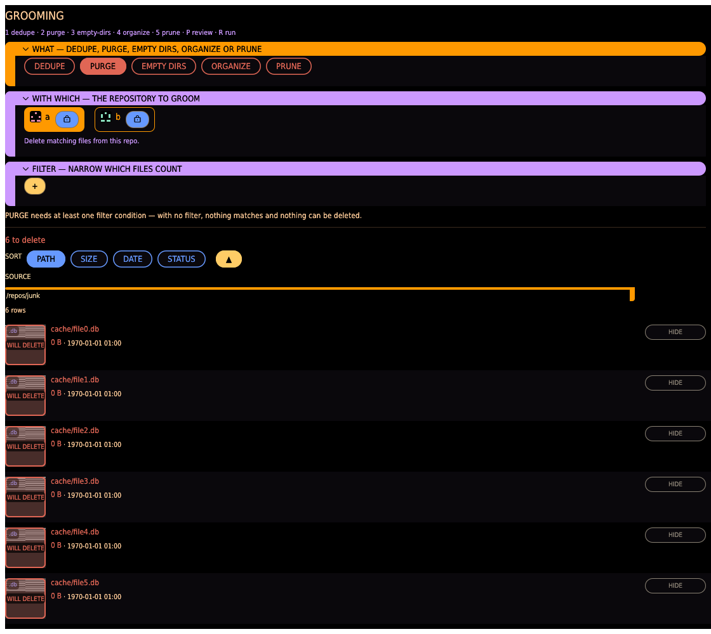

# Grooming tab

Tidy a single repository in place: remove redundant copies, delete files by filter, clear
empty directories, reorganize files into a dated/templated tree, or drop stale index records.
Every tool previews on the shared [review board](index.md#the-review-board) first — nothing
touches disk until you RUN.

## Command

Pick a grooming tool with the segmented selector (or the number keys `1`–`5`):

- **DEDUPE** — find files in this repo whose content also exists **elsewhere** (in other
  repositories you pick as references) and delete the redundant local copies. Each row names
  the surviving copy that makes the local one redundant, so the list reads "this goes, because
  that stays" — and a **COMPARE** button opens the pair in the shared viewer so you can look
  before you delete. Your repo is only ever trimmed of content that is safely held somewhere
  else — and never of content you [accepted](duplicates.md#accepted-content) in it: accepted
  files are left out of the REVIEW preview and of the run.
- **PURGE** — delete files in this repo matching a [filter](transfer.md#filter-builder).
  Purge needs at least one condition: with no filter nothing matches and nothing is deleted,
  so you can never empty a repo by leaving the filter blank. Useful for sweeping out a class of
  files (thumbnails, a MIME type, everything over a size).
- **EMPTY DIRS** — remove directories left empty on disk (e.g. after a MOVE or DEDUPE). The
  index is unaffected; this only tidies the folder tree.
- **ORGANIZE** — move files into a folder tree built from a **path template**
  (`{year}/{month}/{o-name}` and friends), typically by capture/modification date, so a flat
  dump becomes a browsable `2019/05/…` structure. Rules nest, and the template is editable
  inline with clickable field tokens.
- **PRUNE** — drop index records for files that are no longer on disk (the **missing**
  entries). This is index hygiene only — it removes tracking records, never files.

## Repo and filter

- **REPO** — the single repository to groom (DEDUPE also takes the reference repos it checks
  against).
- **FILTER** — the same condition builder the [Transfer tab](transfer.md#filter-builder) uses.
  Required for PURGE; optional for the others, where it narrows which files a preview considers.

## Review and run

- **REVIEW** builds the preview on the shared board without touching disk. PURGE, DEDUPE and
  ORGANIZE rows show what would be deleted or moved (DEDUPE naming the surviving copy, ORGANIZE
  the destination path); **HIDE** parks a row so RUN skips it. PURGE and PRUNE rows are
  one-sided and carry no COMPARE (there is no counterpart to look at).
- **RUN** applies the plan on a background thread behind a confirmation that states the exact
  count. Live progress shows the current file and a running tally; **CANCEL** stops further
  work without rolling back what already ran.
