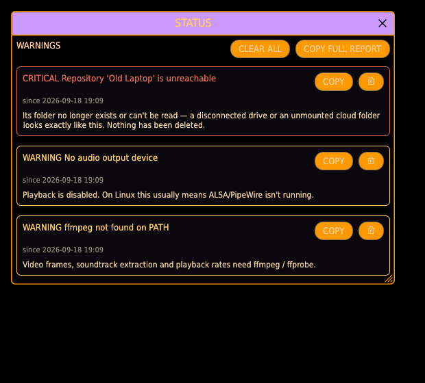
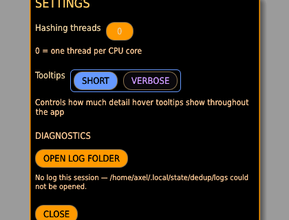
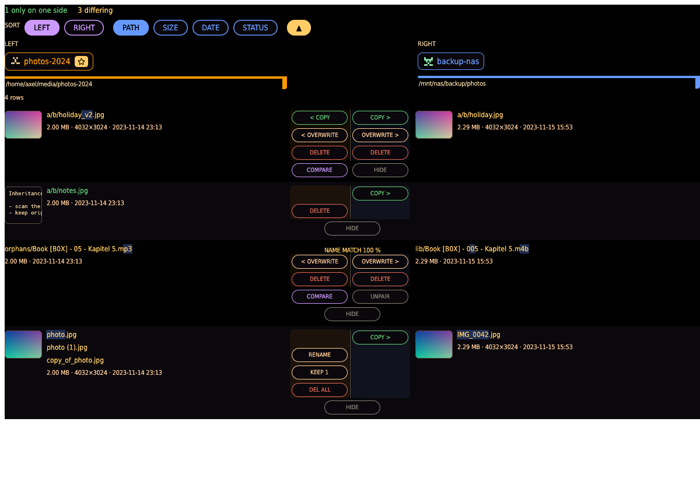

# GUI guide

`dedup` with no arguments opens the desktop app: a single LCARS-styled window with five tabs
— [Repositories](repositories.md), [Duplicates](duplicates.md), [Transfer](transfer.md),
[Grooming](grooming.md), and [Browse](browse.md) — plus a settings cog and an about button in
the top-right. Every tab that shows two files side by side, or a single file up close, opens
the **one shared viewer** described in [The viewer](duplicates.md#the-viewer-lightbox).

Launch with `--ui-scale <0.5–3.0>` to scale the whole interface, e.g. `dedup --ui-scale 1.25`
for a HiDPI display or a projector.

## The tabs at a glance

| Tab                                  | What it is for                                                                                     |
| ------------------------------------ | ------------------------------------------------------------------------------------------------- |
| **[Repositories](repositories.md)**  | Register, scan and manage repositories; frame backup groups (a main and its sinks).               |
| **[Duplicates](duplicates.md)**      | Find exact or perceptually similar duplicates across repos and delete the worse copies.           |
| **[Transfer](transfer.md)**          | Copy / move / sync / mirror between repos, push a backup group, or reconcile two repos with DIFF.  |
| **[Grooming](grooming.md)**          | Tidy one repo: dedupe against others, purge by filter, clear empty dirs, reorganize, prune.       |
| **[Browse](browse.md)**              | Walk one repo's indexed files as a folder tree, preview them, and annotate with tags.             |

## Top bar

The tab buttons switch views; the current tab is highlighted. On the right:

- **STATUS** opens the health/activity centre (below). Its label carries an amber
  count when there are unread warnings.
- **HELP** explains the current tab.
- **SETTINGS** (cog icon) opens the settings dialog below.
- **ABOUT** shows the version, license, and contact info.

## Status: warnings and activity

The **Status** button is the one place the app tells you something is wrong or busy —
so a problem never fails silently. It has two sections:

- **Warnings** — health issues, each **Critical** (red) or **Warning** (amber), never
  a mere log line. At launch the app probes the things that fail quietly: the **audio
  output device** (so "no sound, no error" becomes a visible warning), **ffmpeg/ffprobe**
  (video frames, soundtrack extraction, play-rates), **pdftoppm** (the Render tab), and
  **LibreOffice** (rendering office and legacy documents as pages).
  At runtime, a repository whose folder has gone (a disconnected drive, a closed cloud
  mount) files one aggregated Critical that clears when it returns. Every warning says
  **since when** it has been true (first seen — a repeat doesn't reset it), and each can be
  dismissed with its trashcan, or all at once with **CLEAR ALL** (anything still wrong comes
  back when it is detected again). Each warning has a **COPY** button (its message plus a
  system fingerprint — app version, OS, and which tools/devices are present), and
  **COPY FULL REPORT** adds every warning and the recent log. Both go to your **clipboard
  for a bug report — the app sends nothing anywhere**.
- **Activity** — the heavy background work you can watch and stop: a running or queued
  **scan** shows here with **CANCEL**, so a long scan can be ended without killing the app.

## Copying names and paths

Any file name or path label — on cards, review rows, the Browse table, or the viewer's
filename — can be **right-clicked → Copy**, so grabbing a name to search another
repository never requires a keyboard shortcut.

## Repository locks

Every repository starts **locked** at each launch. The padlock on a repo's chip — the same
chip on every tab — shows and toggles it: **closed blue = protected, open = unlocked**.

A lock protects the repo's **existing files**: while locked, nothing in the app can delete or
overwrite them — those buttons are withheld or disabled with the reason on hover, a MIRROR or
MOVE that would lose data there won't run, and a locked MIRROR sink can't be included in a
GROUP SYNC push. **Adding files to a locked repo is always allowed** — the lock guards what
exists, it never blocks gaining data.

Unlocking is a per-session, per-repo declaration that losing data there is acceptable: from
then on destructive actions run **without further questions** (batch operations still show
their plan first — that's workflow, not a nag). Locks are deliberately not remembered across
launches; consenting to loss is a fresh choice each session.

## Settings dialog

- **Hashing threads** — how many threads a repo scan uses to hash files in parallel (a
  `DragValue`, drag or click to type). `0` lets the hashing library pick one thread per CPU
  core; raise it on a multi-core machine with a fast disk for quicker scans.
- **Tooltips: SHORT / VERBOSE** — controls hover-text detail throughout the app. **SHORT**
  keeps every tooltip a one-line hint; **VERBOSE** expands them into a fuller paragraph
  explaining what the control does and when to use it. This is the setting to flip on if
  you're new to the app and want the interface to teach you as you hover, or back to SHORT
  once you know your way around.
- **Appearance: SYSTEM / LIGHT / DARK** — which colour appearance the interface uses.
  **DARK** is the default classic LCARS look; **LIGHT** is an opt-in light appearance; and
  **SYSTEM** follows your desktop's own light/dark setting and switches whenever that does.
  Choosing one applies it instantly. Dark is deliberately the default rather than System:
  colour here is semantic — red means a file will be deleted — so an update never silently
  repaints an existing user's vocabulary, least of all on a light desktop.

These settings persist across launches, written to `gui_settings.json` in the config
directory (`$XDG_CONFIG_HOME/dedup`, or `~/.config/dedup` by default) the moment they change.
A settings file written before the light appearance existed loads as Dark, so upgrading never
changes how the app looks.
Session logs live separately under `$XDG_STATE_HOME/dedup/logs` (default
`~/.local/state/dedup/logs`), ten runs deep, reachable from Settings → OPEN LOG FOLDER. Per-repo read-only state is
deliberately **not** persisted — every repo re-locks on launch as a safety default, since
unlocking for deletion should be a fresh, conscious choice each session.

## The review board

Every preview and reconcile view renders on one shared board, so it reads the same wherever it
appears.

- **Three regions.** A mini-overview of the left-hand file, a centre column of commands, and —
  when there is one — the right-hand file. The left and right stay pinned to the window edges.
- **A command sits on the side it changes.** The command column is split down a midline into
  two half-columns, faintly tinted in each side's colour: everything in the left half changes
  the left file, everything in the right half the right file — `DELETE` in the left half
  deletes the left file, no suffix needed. A command never crosses the midline, and an empty
  half means exactly that: nothing happens to that side. Copies and overwrites sit on the side
  they *fill* (`< COPY` in the left half pulls the right file across), with the arrow naming
  where the file flows from. A command and its mirror share a line, and commands that act on
  the row as a whole — `COMPARE`, `APPLY`, `HIDE` — are centred below. Only the commands that
  apply to a row are drawn, and a row is as tall as its content needs.
- **A cell only ever talks about itself.** If a side has a file, its cell shows that file's
  preview — always — veiled only with the side's *own* state: red **WILL DELETE** on a file a
  plan removes, amber **MISSING** when it is gone from disk. The side a file will *arrive* at
  shows the incoming file's preview under green **NEW**; a side that once held exactly this
  content and deleted it shows a blue **WAS DELETED** tombstone cell (no file, no preview) —
  copying across would resurrect that deletion. Conflicts show the occupying file itself.
  Rows where neither side has a living file don't appear at all.
- **Path colour says what will happen.** Grey means unchanged or equal on both sides, green
  exists only on this side (or will be added), red will be deleted, amber differs — the same
  path with different content, or the same content under a different name.
- **HIDE** removes a row from the board, and on a preview also from what RUN will do. It is
  one-way: press REVIEW again to start over.
- **Sorting** is the bar above the board — which side to read, then the key (path, size, date
  or status), then the direction. Large previews scroll rather than paging.

## Document formats read as text

The tool understands these formats as *text documents* — it extracts their words, which is what
lets it group two files that say the same thing even when their bytes differ (a `.docx` and the
`.pdf` exported from it, or the same report re-saved). Extraction is built in; no external tool
is needed for it.

| Kind | Formats |
| --- | --- |
| Portable documents | PDF |
| Word processing | `.docx`, `.odt` |
| Spreadsheets | `.xlsx`, `.xls`, `.ods` |
| Presentations | `.pptx`, `.odp` |
| Email | `.eml` |
| Plain text | any `text/*` — `.txt`, `.md`, `.csv`, `.html`, `.json`, source code, logs |

Legacy binary `.doc` (Word 97–2003) is **not** among them — only the modern OOXML/OpenDocument
containers are. A `.doc` or `.rtf` can still be *looked at* as rendered pages in the viewer's
Render tab (via LibreOffice) — it just can't be read as text. Everything else (images, audio,
video, archives, unknown binaries) is compared by its own means — a perceptual fingerprint, or
its raw bytes — never as text.

## What's not here

The important-file scanner (`dedup scan`) and the triage report (`dedup report`) are
CLI-only today — there's no dedicated GUI tab for them yet.

## See also

- [Repositories tab](repositories.md) — register, scan, rename, relocate, duplicate, delete;
  sync groups.
- [Duplicates tab](duplicates.md) — find and review exact/similar duplicates, and the shared
  viewer in full (Image / Video filmstrip + scrub / Audio / Metadata / Text / Render /
  Strings / Hex).
- [Transfer tab](transfer.md) — copy/move/sync/mirror between repos by content, group sync and
  sync-back, the DIFF reconcile board, the filter builder.
- [Grooming tab](grooming.md) — dedupe, purge, empty dirs, organize, prune.
- [Browse tab](browse.md) — a keyboard-driven folder-tree browser with tagging.
- [CLI reference](../cli.md) — every command the GUI's operations are also available from.
