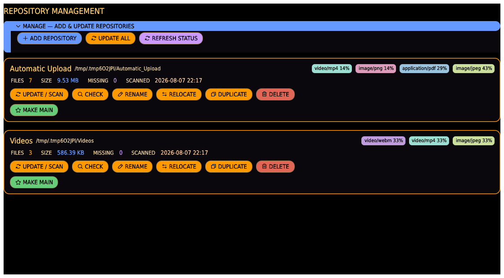
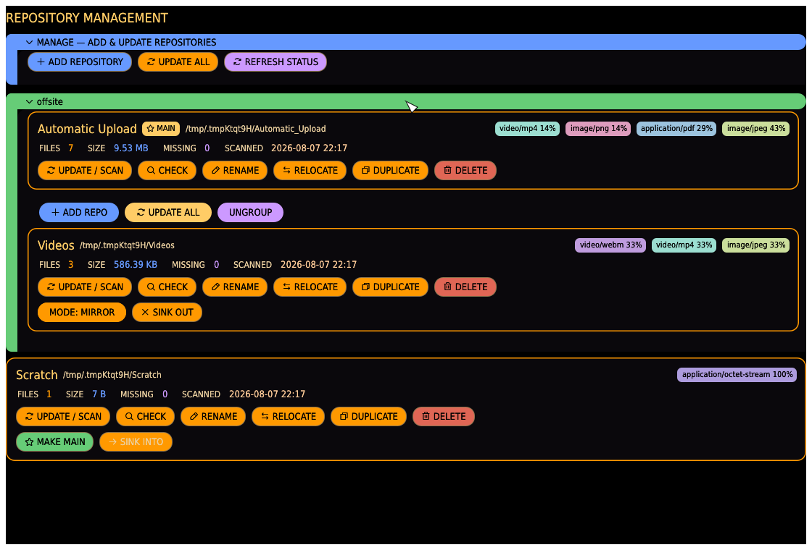

# Repositories tab

Register, scan, and manage repositories — a repository is a name linked to a folder on
disk, tracked by its own index. This tab is the GUI equivalent of the [`repo`
subcommand](../cli.md#repo).

## Action bar

- **ADD REPOSITORY** — opens a dialog to register a new folder (see below). Disabled while
  a scan is running elsewhere in the app.
- **UPDATE ALL** — queues an UPDATE / SCAN for every registered repository, one at a time.
  Already up-to-date repos finish almost instantly.
- **REFRESH STATUS** — re-checks every repository's location/reachability and whether its
  index is stale (a dry-run — no hashing, no writes). This is what produces the LOCAL /
  REMOTE / OFFLINE / MISSING and UP TO DATE / UPDATE REQUIRED pills on each card.

## Repository cards

Each card shows the repository's name, its on-disk path, status pills, a MIME-type
breakdown (top few types by share, pinned top-right), and stats:

| Stat    | Meaning                                                                                                                                            |
| ------- | -------------------------------------------------------------------------------------------------------------------------------------------------- |
| FILES   | Indexed files (files that vanished from disk since the last scan are excluded).                                                                    |
| SIZE    | Total on-disk size of indexed files.                                                                                                               |
| MISSING | Files indexed before but no longer found on disk — kept as history, excluded from stats and duplicate search until a rescan confirms they're back. |
| SCANNED | When this repository was last scanned ("never" if it hasn't been).                                                                                 |

Status pills:

- **LOCAL** / **REMOTE** — the folder is on this machine, or on a reachable network mount.
- **OFFLINE** — a network mount that isn't reachable right now; scans and checks will fail
  until it's back.
- **MISSING** — the local folder no longer exists or can't be read; RELOCATE it or restore
  the folder before scanning.
- **UP TO DATE** / **UPDATE REQUIRED** — from the last CHECK: whether there are new,
  changed, or missing files since the last scan.

## Per-repository actions

- **UPDATE / SCAN** — walk the folder, hash new/changed files, mark vanished files missing.
  Fast on a repeat run since unchanged files are skipped.
- **CHECK** — dry-run: report new/changed/missing counts without hashing or writing
  anything. Use this to see if UPDATE / SCAN has real work to do.
- **RENAME** — change the repository's registry name in place; the on-disk folder is not
  moved.
- **RELOCATE** — point the repository at a different on-disk folder, keeping its existing
  index. Use this after moving the data to a new location.
- **DUPLICATE** — clone the entire index into a brand-new repository at a new path. The
  source is left completely unchanged — for branching off a snapshot, not moving anything.
- **DELETE** — remove the registry entry and its index database. The on-disk files it
  tracked are **never touched**; only the tracking record disappears.

A repository mid-scan or mid-check shows a spinner, live progress (a bar with percent/count
for hashing, a file/dir count while scanning), and a CANCEL button — cancelling a scan keeps
whatever was already hashed committed to the index.

## Sync groups

A **sync group** links one **main** repository to one or more **backup** repositories
(**sinks**). Groups are managed right here on the repo cards; pushing one is done from the
[Transfer tab](transfer.md#group-sync)'s **GROUP SYNC** command, offered whenever the selected
source is a group's main:

- **MAKE MAIN** (on an ungrouped repo) — turn the repository into the main of a new group.
- **SINK INTO ▾** (on an ungrouped repo, when a group exists) — add it to an existing group
  as a backup.
- A group is framed by its own **LCARS section**, titled with the group name: the main's card
  and every sink's card sit inside one rail, so a group reads as a single block and an
  ungrouped repository as a bare card. Groups start **folded** — the list stays about your
  originals — and clicking the section header opens one.
- The main carries a **★ MAIN** badge. The same badge appears on the repo chip wherever the
  repository is named — Files, Grooming, Duplicates, Browse and the lightbox — so an original
  is never mistaken for a backup.
- A main's card gains a **group controls** row:
  - **ADD REPO** — add a *new* backup that starts as a clone of the main's index, pointed at
    a folder you choose (the main is left unchanged).
  - **UPDATE ALL** — queue an UPDATE / SCAN for the main and every backup in the group.
  - **UNGROUP** — disband the group; every repository stays, just unlinked.
- Sinks are shown inside their group's section rather than as top-level repositories, and are
  managed there like any other repository. Each sink card carries its own **mode pill** —
  `ADD ONLY` copies what that backup lacks; `MIRROR` also deletes from it what the main no
  longer has (click to flip) — and **SINK OUT** to take it back out of the group. A group can
  mirror some backups and only-add to others.

## Add Repository dialog

- **FOLDER** — type a path, or **CHOOSE…** to open a native folder picker.
- **NAME** — the repository's display name; leave blank to default to the folder's own
  name. Must be unique among registered repositories (a clash is flagged in red before you
  can submit).
- **ADD** registers the repository (it is not scanned automatically — run UPDATE / SCAN
  afterwards); **CANCEL** closes without registering anything.
